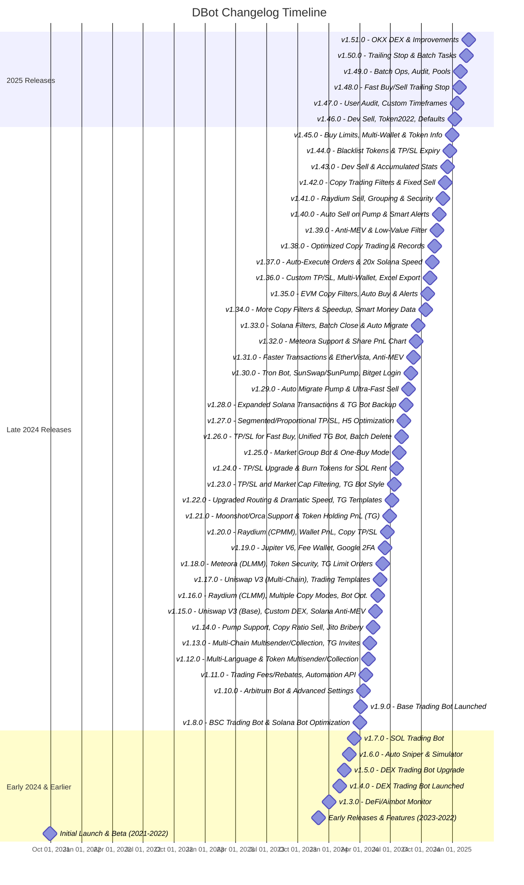

# 🚀 DBot - The Ultimate Crypto Trading Automation Platform


**Automate your crypto trading across multiple chains with lightning-fast execution, advanced features, and AI-powered analytics.**

[Visit DBotX](https://dbotx.com/?ref=83357810)
[](https://dbotx.com/?ref=83357810)

## 🔥 Why Choose DBot?

✔ **Multi-Chain Support**: Solana, BSC, Ethereum, Arbitrum, Base, Tron & more  
✔ **Zero Delays**: Sub-second trade execution with anti-MEV protection  
✔ **Smart Money Tracking**: Copy top traders with one click  
✔ **Advanced Order Types**: Limit, TP/SL, Trailing Stop, Dev Sell & more  
✔ **API Access**: Full programmatic trading control  

## 🛠️ Key Features

- **Auto-Migration** between DEXs when markets are full
- **PumpSwap Integration** for Solana trading
- **Multi-Wallet Management** with consolidated PnL
- **Token Security Analysis** (honeypot, LP burnt, etc.)
- **Batch Operations** for mass position management

## 📈 Recent Major Updates (v1.56.0)

```diff
+ Added auto-migration of TP/SL to PancakeSwap when four.meme market full
+ PumpSwap for Solana fully supported (fast trading/copy trading/limit orders)
+ Marketing K-Line structure optimized
+ Solana transaction speed improvements
```


# Changelog


---

## 🌟 Start Trading Smarter Today!

Don't miss your chance to join the world of copytrading and achieve financial freedom.  
👉 **[Sign Up](https://dbotx.com/?ref=83357810)**  

Last Update: 2025-05-28
